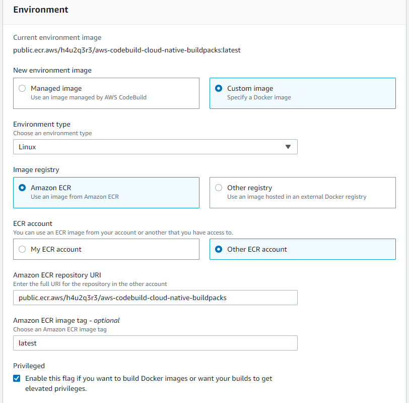

# AWS CodeBuild Cloud Native Buildpack pack CLI Docker image

This repository holds a Dockerfile based on [AWS CodeBuild Docker Images](https://github.com/aws/aws-codebuild-docker-images) with focus on building [Cloud Native Buildpacks](https://buildpacks.io/) using [`pack CLI`](https://buildpacks.io/docs/tools/pack/#pack-cli).

[](https://us-east-1.codebuild.aws.amazon.com/project/eyJlbmNyeXB0ZWREYXRhIjoiSnh1TjBMZzB1NGRTODZmWVhNcWpCelY3Sk9wcno0SmJsQkE3eWlTMjR1bGV4eUVON2lQT3RBa1VhRFBwOTRvUkd5cU5TWGRrdXlKQ240aFJ4ZXg0a3pUVzhVRDRBa0hqSHlZd2JtYzVPMXR6bUc0R0JqZUhlbzZvQjNhQW9LZllPYWlmIiwiaXZQYXJhbWV0ZXJTcGVjIjoiVTY5NmRZY0ZNandMeC93UyIsIm1hdGVyaWFsU2V0U2VyaWFsIjoxfQ%3D%3D)

### Advantages

- Does not require to install `pack` and other dependencies at runtime
- Will provide `docker login` implicitly as CodeBuild service role allows
- Build step is automatically skipped if commit is the same
- Will register deployments within NewRelic API

### Current process steps:

1. Test (TBD)
2. Build
3. Release/Render
4. Provision
5. Deploy

### How to use this image on AWS Codebuild

Create or edit your CodeBuild project's evironment sections and override as described below:



Create a `buildspec.yml` like this:

```yaml
version: 0.2
phases:
  build:
    on-failure: ABORT
    commands:
      - dockerd-entrypoint.sh main.sh
```

### **Extra Features**

- Creation of scheduled tasks
- Execution of code before release (database migrations, assets upload, etc)

### **Procfile**

Below you can see a sample `Procfile` that demonstrates some of Maestro's capabilities:

```
web: bundle exec unicorn -p $PORT -c config/unicorn.rb # binds unicorn via $PORT to an ALB for incoming traffic
worker: bundle exec sidekiq -C config/sidekiq.yml      # runs sidekiq for processing background jobs
clock: bundle exec rails runner bin/clock              # loads a cron based service that will trigger commands
scheduledtasks: tasks.run                              # creates tasks for one-off executions scheduled at tasks.run
release: bundle exec db:migrate                        # runs database migration right before the release is deployed
```

### **Environment Variables**

Variable | Description | Examples/Values | Default
---|---|---|---
 `ALB_SCHEME` | Scheme of the ALB <br><br> **Choose only one of the example values** | `internet-facing` <br> `internal` | `internet-facing`
 `ALB_SECURITY_GROUPS` | Security Groups linked to ALB <br><br> *Multiple values can be assigned using comma as separator* | `sg-qwerty` <br> `sg-asdfgh,sg-nth` 
 `ALB_SUBNETS` | Subnets linked to ALB <br><br> *Multiple values can be assigned using comma as separator* | `subnet-qwer1234567890` <br> `subnet-asdf0987654321,subnet-nth` 
 `ECS_EFS_VOLUMES` | Add EFS volumes for ECS tasks <br><br> *Multiple values can be assigned using comma as separator* | `<volume-name>:<filesystem-id>{<efs-root>@<path-to-task-build>;<to-encrypt-in-transit>}` <br> `storage-efs:fs-013a693f90df46413{/@public/storage;encrypted},images-efs:fs-0bd8f82bba0a89448{/@public/images;encrypted}` 
 `ECS_EXECUTION_ROLE_ARN` | IAM Role ARN linked to ECS Execution | `arn:aws:iam::0123456789:role/<role-name>` 
 `ECS_SERVICE_SECURITY_GROUPS` | Security Groups linked to the ECS Service <br><br> *Multiple values can be assigned using comma as separator* | `sg-qwerty` <br> `sg-asdfgh,sg-nth` 
 `ECS_SERVICE_SUBNETS` | Subnets linked to the ECS Service <br><br> *Multiple values can be assigned using comma as separator* | `subnet-qwer1234567890` <br> `subnet-asdf0987654321,subnet-nth` 
 `ECS_SERVICE_TASK_PROCESSES` | Processes intended to have a service to be created according to Procfile <br><br> *Multiple services can be assigned using comma as separator* <br> <br> *For CPU and RAM assignment use semicolon as separator and curly brackets as container* <br> *For number of tasks assignment use colon as separator and a dash between numbers to define max task auto scaling value* <br> *For CPU and RAM usage percentage and ALB request count auto scaling triggers assignment use semicolon as separator and square brackets as container* | `web` <br> `web,worker` <br> `web{1024;2048}:2-5[mem=55;cpu=60;alb=1000]` <br> `web{512;1024}:2,worker{1024;2048}:1-3` <br><br> Add `scheduledtasks{256;512}` process to be able to create Scheduled Tasks. Does not create an ECS service, only enables the feature <br><br> `<process>{<v-cpus>;<mem>}:<min_tasks>-<max_tasks>[<mem=percent>;<cpu=percent>]` <br><br> `<process>` = Process name <br> `<v-cpus>` = Desired number of v-cpus per task x1024 <br> `<mem>` = Desired allocated MB of RAM per task <br> `<min_tasks>` = Minimum amount of tasks per process, can be used without a max value so as to not use auto scaling <br> `<max_tasks>` = Maximum amount of tasks per process <br> `<mem=percent>`= RAM usage percentage auto scaling trigger <br> `<cpu=percent>` = CPU usage percentage auto scaling trigger <br> `<alb=requestcount>` = Load Balancer request count auto scaling trigger <br><br> Example using all default values except for `Tasks per Process`: <br> `test:2-5,scheduledtasks` <br> Fully disclosed example would be: <br> `test{512;512}:2-5[cpu=55],scheduledtasks{256;512}` | `<v-cpus>` = 512 <br> `<mem>` = 512 <br> `<min_tasks>` = 1 <br> `<cpu=percent>` = 55 (if auto scaling is active) <br><br> `scheduledtasks <v-cpus>` = 256 <br> `scheduledtasks <mem>` = 512
 `ECS_TASK_ROLE_ARN` | IAM Role ARN linked to ECS Task | `arn:aws:iam::0123456789:role/<role-name>` 
 `MAESTRO_BRANCH_OVERRIDE` | Temporary overriding of the working branch | `staging` <br> `production` 
 `MAESTRO_DEBUG` | Amplify verbosity of the build <br><br> **Choose only one of the example values** | `true` <br> `false` 
 `MAESTRO_NO_CACHE` | If the cache layer shouldn't be used in the pack build <br><br> **Choose only one of the example values** | `true` <br> `false` 
 `MAESTRO_ONLY_BUILD` | Stops after build if `true`, leave empty otherwise | `true` 
 `MAESTRO_SKIP_BUILD` | Skips build and process following steps if true, leave empty otherwise | `true` 
 `NEW_RELIC_API_KEY` | A user API key from NewRelic for registering deploys | `NRAK-XXXXXXXXXXXXXXXXXXXXXXXXX`
 `NEW_RELIC_APP_ID` | NewRelic APM's application identifier | `123456789` 
 `DEPLOY_WEBHOOK_URL` | A custom webhook URL for registering deploys | `https://example.com/my-webhook?apikey=123456&cluster_id={{CLUSTER}}&service={{SERVICE}}&repository={{REPOSITORY}}`
 `WORKLOAD_RESOURCE_TAGS` | Tags related to the workload that will be used to all resources provisioned <br><br> *Examples include tag name (case-insensitive) and value* | `workload=myapp` <br> `environment=staging` <br> `owner=me` 
 `WORKLOAD_VPC_ID` | VPC ID of the workload | `vpc-ad1234df` <br> `vpc-qw56er78` <br> `vpc-zxcvghjk`
 `DEPLOYMENT_CIRCUIT_BREAKER_RULE` | Enable or disable circuit breaker | `enable=true,rollback=true`
 `ECS_CONTAINER_STOP_TIMEOUT` | Set stopTimeout on taskdefinition | min: 0, max: 120, default: 30
 `TZ`| Set this variable to the desired task timezone | America/Sao_Paulo
 `WORKLOAD_PATH`| Set the workload path to run build commands on should do it | ./Projects/my-app, ./

 ### How to enable scheduled tasks
- Create a file tasks/run_tasks.conf with the schedules on your code:
  Content example:
    update-feeed rate(3 hours) bundle exec rake feed:update
    send-mail rate(12 hours) bundle exec rake mail:send
    update-invoices rate(6 hours) bundle exec rake client:update_invoices

- Update your project code, adding the following to Procfile:
  scheduledtasks: scheduledtasks: tasks/run_task.conf

- On codebuild environment variables, increment the ECS_SERVICE_TASK_PROCESSES with "scheduledtasks{256;512}" as described in the table above.

### How to build Docker image

Steps to build image:

``` bash
$ git clone https://github.com/veezor/maestro.git
$ docker build -t maestro:latest .
```

### Release process
To trigger [the release workflow](https://github.com/veezor/maestro/blob/main/.github/workflows/release.yml) and deploy the image on AWS public ECR repository use one of the two approaches below:

1. Create a pull request for your changes or bug fixes. This will deploy a pre-release image that can be tested with the proposed changes.
2. Create a new tag and a new release, following [semantic versioning parameters](https://semver.org/).

### How to register a deploy with a webhook
Maestro allows you to register a deploy with a custom webhook using a standard `GET` request which expects a `200` response. To trigger this feature, you need to define `DEPLOY_WEBHOOK_URL` environment variable and its value may contain the following placeholders within the URL:

- `{{CLUSTER}}` for the cluster's name
- `{{CLUSTER_LINK}}` for the cluster's link
- `{{REPOSITORY}}` for the repository's slug
- `{{REPO_LINK}}` for the repository's link
- `{{BUILD_LINK}}` for the build's log link


### Contributing
Feel free to suggest improvements by opening pull requests.
